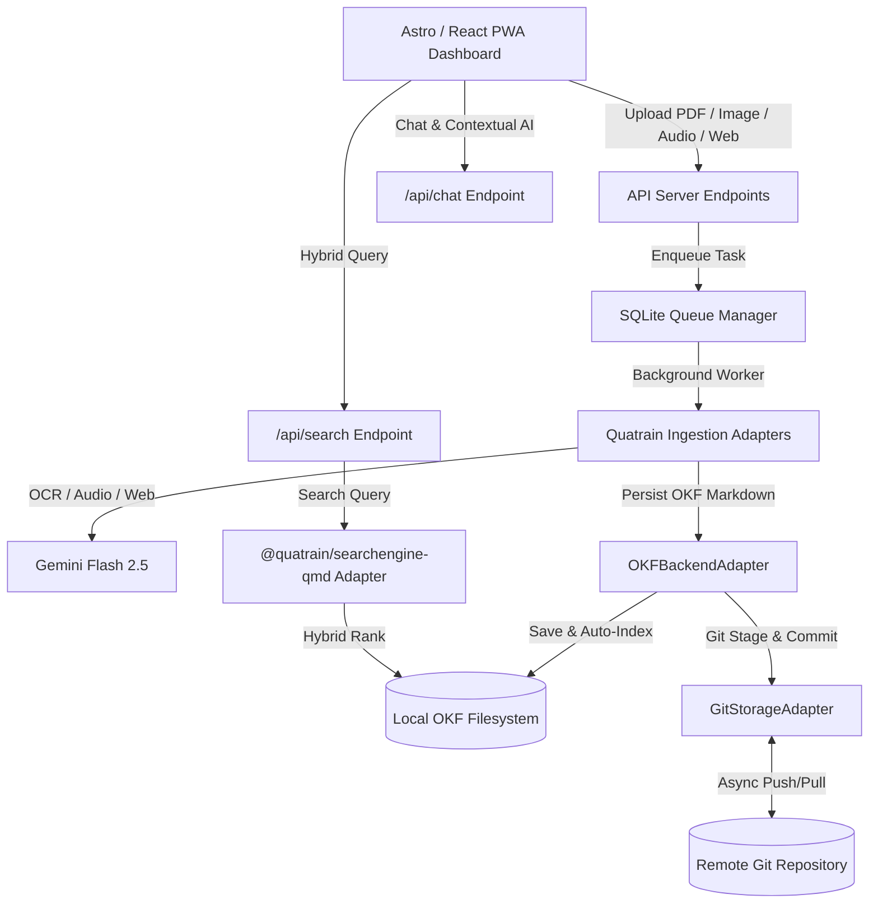

# Modaka — Digital Knowledge Copilot & Sovereign Edge Brain

[](https://www.gnu.org/licenses/agpl-3.0)
[](https://www.typescriptlang.org/)
[](https://astro.build/)
[](#)
[](#)
[](#)

**Modaka** is a decentralized, local-first, touch-optimized digital knowledge base and personal AI copilot built on **Astro 5**, **React**, **Quatrain Core**, and **Google Gemini AI**. It organizes your notes, audio transcripts, PDFs, images, and web research using the standardized **OKF (Open Knowledge Format v0.1)** structure backed by local Git storage.

---

## 🧭 Core Engineering Principles

### 1. Local-First Architecture
- **Single Source of Truth**: The local disk (`.modaka-data`) is the primary reading and search target.
- **Instant Synchronization**: Modaka bypasses indexing caches on read operations, ensuring that manual filesystem edits, file renames, or external note additions are visible immediately in the UI and to the LLM.

### 2. OKF (Open Knowledge Format v0.1) Compliance
Every document imported or generated is stored as clean, human-and-AI-readable Markdown:
- **Flat YAML Frontmatter**: Bounded by `---`. Null, empty string (`""`), or undefined fields are omitted.
- **Semantic Concept Kinds**: The `type` field specifies the functional nature of the knowledge item (e.g., `specification`, `guide`, `screenshot`, `invoice`, `recipe`, `note`, `concept`).
- **Human-Readable Slugs**: File and directory names use lowercase slugified titles instead of obscure UUIDs (e.g., `/content/technology/ai/okf-spec.md`).

### 3. Progressive Disclosure Navigation
- **Recursive Indices**: Every category directory contains an auto-generated `index.md` file listing child subcategories and concept documents.
- **Token Efficiency**: AI agents and LLM tools navigate the knowledge graph step-by-step using Markdown links without overwhelming their context window.

### 4. Hybrid Search Engine Integration (`@quatrain/searchengine-qmd`)
- Integrates **QMD (Query Markup Documents)** hybrid search combining **BM25 term matching**, **vector semantic search**, and category filtering.
- Exposed natively via the `/api/search` API endpoint and consumable by external agents.

### 5. Resilient Background Processing
- Asynchronous task processing powered by **SQLite Queue** (`@quatrain/queue-sqlite`).
- Ingestion tasks (PDF OCR, Audio Transcription, Web Scraping, Wikipedia Auto-Linking) run safely in the background with progress reporting and automatic retries.

---

## 🏗️ System Architecture



---

## 🌟 Key Application Features

### 📊 Multi-Mode Analytics & Knowledge Graph
The **Stats** module offers three distinct visualization perspectives:
1. **Synthetic Metrics Table**: Live counters of documents, media files, hyperlinks, and category distribution.
2. **Interactive Link Network Graph**: Dynamic SVG visualization mapping cross-document relationships with hover tooltips and category color-coding.
3. **AI Metrics & Conversation Log**: History of past chat sessions with token consumption estimations, average response latency, and instant one-click export to OKF Markdown documents.

### 🔍 QMD Hybrid Search API
Run multi-modal queries across your knowledge base:
```http
GET /api/search?q=ISO+27001&category=certification&mode=hybrid&limit=10
```

### 🎙️ Multi-Format Ingestion Pipelines
- **Audio Notes**: Transcribes live or uploaded audio recordings (`.wav`, `.m4a`, `.mp3`) and derives structured summaries.
- **Multimodal OCR**: Extracts text from scanned PDFs and images with complete layout fidelity using Gemini Vision.
- **Web Crawling**: Scrapes web pages, strips boilerplate navigation, extracts Markdown body text, and recursively processes sub-links.
- **Wikipedia Concept Auto-Linking**: Identifies proper nouns in documents and automatically pulls Wikipedia summaries to build concept pages under `content/concepts/`.

---

## 🛠️ Monorepo & Core Package Dependencies

Modaka relies directly on the **Quatrain Core** modular ecosystem (`/Users/crapougnax/CODE/QUATRAIN/Core`):

| Package | Role & Responsibility |
|---------|------------------------|
| `@quatrain/core` | Core runtime container and singleton registry. |
| `@quatrain/backend` | Abstract backend persistence layer and query builders. |
| `@quatrain/okf` | Open Knowledge Format adapter and recursive `index.md` generator. |
| `@quatrain/searchengine` | Abstract search engine contract and registry manager. |
| `@quatrain/searchengine-qmd` | QMD (Query Markup Documents) hybrid BM25/Vector search adapter. |
| `@quatrain/ai-gemini` | Gemini Pro and Flash LLM integration provider. |
| `@quatrain/ingestion-ocr` | Multimodal document OCR processing pipeline. |
| `@quatrain/ingestion-audio` | Audio transcription and metadata extraction. |
| `@quatrain/queue-sqlite` | SQLite-backed background task queue. |
| `@quatrain/storage-git` | Git repository transport layer for version control. |

---

## 🚀 Quick Start Guide

### Prerequisites
- **Node.js**: `>= 22.0.0`
- **Package Manager**: [Yarn Berry](https://yarnpkg.com) or [Bun](https://bun.sh)
- **API Key**: [Google AI Studio](https://aistudio.google.com/) Gemini API Key

### Environment Configuration (`.env`)
Create a `.env` file in the root directory:

```env
GEMINI_API_KEY=your_google_gemini_api_key_here
GEMINI_MODEL=gemini-2.5-flash

GIT_MODE=local
GIT_LOCAL_PATH=/absolute/path/to/modaka-data
DOCUMENT_STORAGE_PATH=/absolute/path/to/modaka-documents

OKF_STORAGE_PATH=/absolute/path/to/modaka-data/content
S3_BUCKET=documents
```

### Installation & Local Server

```bash
# Install dependencies
yarn install

# Run development server
yarn dev
```

The application will be accessible at `http://localhost:4321`.

### Running Tests
Execute the Vitest suite (35+ unit tests):
```bash
yarn test
```

---

## 📄 License

This project is licensed under the **AGPL-3.0-only** license. See the [LICENSE](file:///Users/crapougnax/CODE/CRAPOUGNAX/modaka/package.json#L7) file for details.
